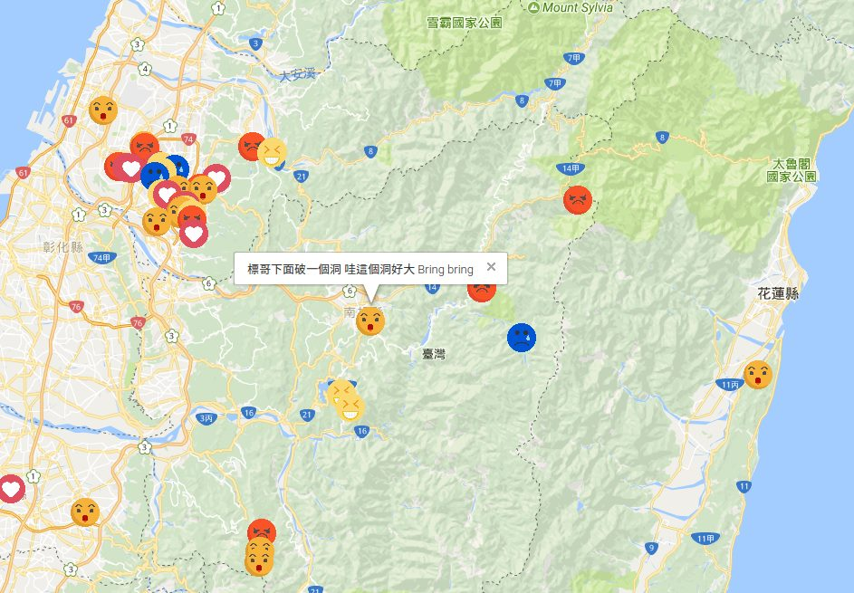

# Emotion-Map

This application used Facebook API and Google Maps API to build the Facebook Media Map. It allows people to log in via Facebook and map the posts and the check-in locations on the google map.

After login to Facebook, Emotion Map will try to load your media locations. With the Emotion Classifier built from Idea Lab, the emotion of the posts is extracted. When finishing the loading and emotion classifing procedure, the Facebook Emotion Map will show up with different emoticon that plot on different locations.

Btw, click on the single photo, it will show the detail of this post.

For example: 

[Let's go to Demo!!](https://idea.cs.nthu.edu.tw/~eunice/emotion_Map)
